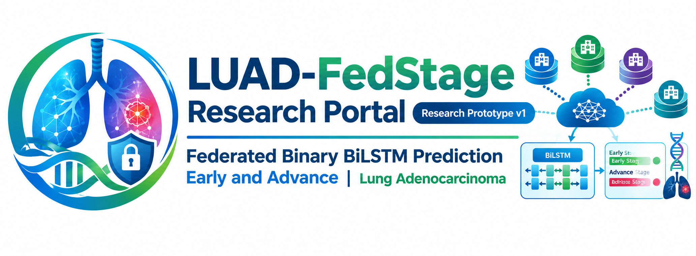

  

# LUAD-FedStage Research Portal

The **LUAD-FedStage Research Portal** provides an interactive demonstration environment for exploring the federated genomic research workflow for **lung adenocarcinoma (LUAD) stage stratification**.

  

### Research Portal

The portal demonstrates a privacy-preserving research environment in which participating research sites can perform local genomic analysis while sharing only appropriate summary-level information for federated research.

**Research and Clinical Use Disclaimer:** This prototype is intended solely for research and methodological development and is not intended for clinical diagnosis, treatment decisions, or direct clinical use. Future research involving higher-dimensional data, larger and more diverse datasets, and next-generation computational methods may contribute to the development of approaches with potential applications in clinical diagnosis and treatment decision support; however, such applications would require appropriate validation, regulatory evaluation, and clinical evidence.

> **Note:** The portal, datasets, source code, and associated research resources are currently **unpublished** and maintained in the **private CHI Lab GitHub repository**.

> ## Research Full Portal Demo

